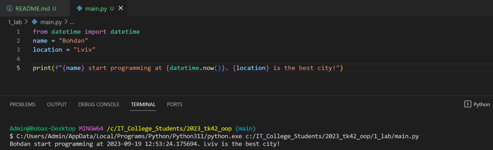

# Звіт до роботи №1
## Тема: _Оформлення робіт та перша програма_;
### Мета роботи: _Навчитись оформляти роботи з використання форматування Markdown та створити першу програму на Python_;

---
### Виконання роботи
- Результати виконання завдання:
    1. Створили [файл з першою програмою](main.py);
    1. Програма вивела текст представлений на скріншоті: 
    1. Створили [Python Notebook `nb.ipynb`](nb.ipynb) та попрактикувались роботі з комірками, модифікували основну програму для роботи з бібліотекою `time`;
    1. Отримані результати виконання комірок Python Notebook представлено у [самаму ноутбуці](nb.ipynb);
    1. Навчились створювати файли для програм Python та інтерактивно працювати у Python Notebook;
    1. Попрацювали з ChatGPT та запитались як модифікувати програму на Python. Результат вставлено у  [Python Notebook `nb.ipynb`](nb.ipynb);
    1. Оформили звіт з використанням форматування Markdown;

- індивідуальних завдань не було, хібащо робота з ChatGPT;

---
### Висновок: 

- :question: Що зроблено в роботі: навчились працювати з форматуванням Markdown, створили першу програму на Python, навчились працювати з Python Notebooks :white_check_mark:
- :question: Чи досягнуто мети роботи: так :white_check_mark:
- :question: Які нові знання отримано: вперше попрацював з комірками Python Nonebook :notebook_with_decorative_cover:
- :question: Чи вдалось відповісти на всі питання задані в ході роботи: так :+1:
- :question: Чи вдалося виконати всі завдання: так :ok:
- :question: Чи виникли складності у виконанні завдання: ні :white_check_mark:
- :question: Чи подобається такий формат здачі роботи (Feedback);
- :question: Побажання для покращення (Suggestions);

---