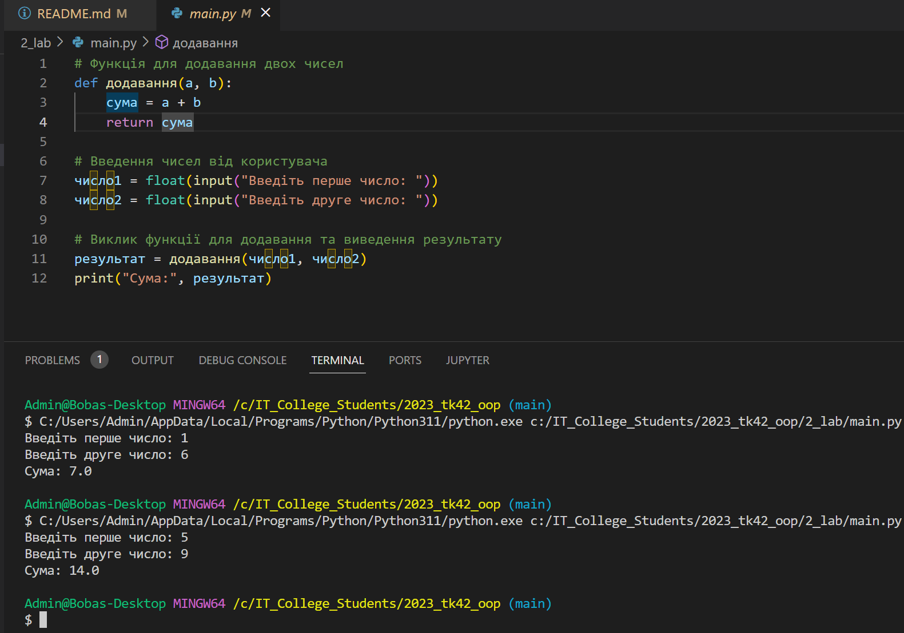

# Звіт до роботи №2
## Тема: _Основи програмування на Python_;
### Мета роботи: _навчитись базовим конструкціям мови Python, виконати приклати та попрацювати з різними блоками коду_;
---
### Виконання роботи
- Результати виконання завданнь:
    1. Створили [Python Notebook](nb.ipynb) та почали виконувати завдання;
    1. Попрацювали з стрічковими обєктами та спробували застосувати до них додавання та множення;
    1. Написали програму кидання кубика, та здійснили її реалізацію за допомогою різних циклів;
    1. Спробували написати програми з різними конструкціями мови Python, працювали з циклами, розгалуженнями, блоками виловлювання помилок та контекст менеджерами.
    1. Програми писались та виконувались у [Python Notebook](nb.ipynb) де представлені всі результати. 
    1. Проробили приклади з основ Python та навчились писати базові програми.
    1. Створювали запити до ChatGPT та виконали запропоновани ним програми.
- результат виконання програми написаної ChatGPT:

- код індивідуального завдання де ми працювали з ChatGPT наведений  [у файлі main](main.py), Результат виконання даного коду представлений на скрінчшоті зверху.

### Висновок: 
> у висновку потрібно відповісти на запитання:
- :question: Що зроблено в роботі: __підсумуйте що робили__
- :question: Чи досягнуто мети роботи;
- :question: Які нові знання отримано;
- :question: Чи вдалось відповісти на всі питання задані в ході роботи;
- :question: Чи вдалося виконати всі завдання;
- :question: Чи виникли складності у виконанні завдання;
- :question: Чи подобається такий формат здачі роботи (Feedback);
- :question: Побажання для покращення (Suggestions);
---