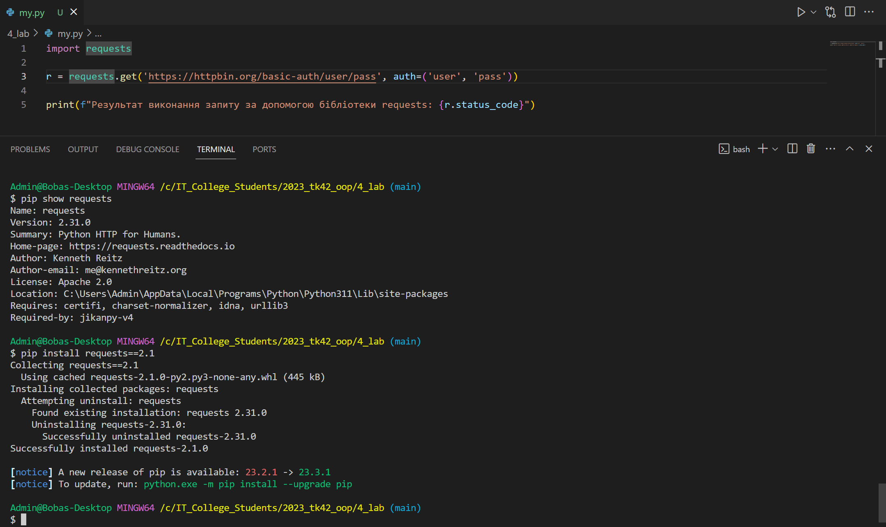
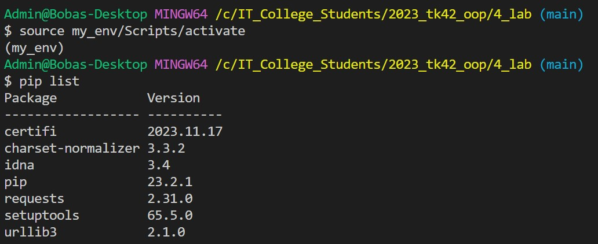

# Звіт до роботи №4
## Тема: _Робота з віртуальними середовищими_;
### Мета роботи: _навчитись створювати та працювати у віртуальних середовищах_;

---
### Виконання роботи
- Результати виконання завдання:
    1. Створили віртуальні середовища за довомогою `venv` та `pipenv`. Інсталювали різні бібліотеки у середовища та порацювали з ними;
    1. Результат виконання команди представлено на скріншоті: 
    1. Створили віртуальне середовище за допомогою `venv` та подивились які там є встановлені бібліотеки 
    1. Теж саме виконали за допомогою `pipenv`;
    1. Програма вивела значення: показуємо на сріншотах де програма виконувалась а де видавала помилку;
    1. Навчились працювати з віртуальними середовищами;
- вставлені рисунки наведені нижче, демонструють процес виконання роботи по кожному з кроків. 

- код програм записаний у файлах: Веб сайт написаний на Flask знаходиться у файлі [app.py](./app.py), а  тестовий код є у файлі [my.py](./my.py)

- результати виконання індивідуального завдання: вставляємо всі наші відповіді, але вказуємо що ми зробили на скріншотах.

---
### Висновок: 
> у висновку потрібно відповісти на запитання:

- :question: Що зроблено в роботі;
- :question: Чи досягнуто мети роботи;
- :question: Які нові знання отримано;
- :question: Чи вдалось відповісти на всі питання задані в ході роботи;
- :question: Чи вдалося виконати всі завдання;
- :question: Чи виникли складності у виконанні завдання;
- :question: Чи подобається такий формат здачі роботи (Feedback);
- :question: Побажання для покращення (Suggestions);

---